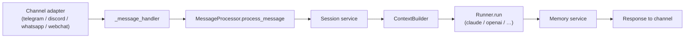

# Architecture

GridBear is a plugin-based framework. A single container (`gridbear`) hosts the bot runtime, the admin UI, the MCP gateway, and the REST API; external channels talk to the agents through plugin adapters, and external tools reach the agents through the MCP gateway.

## Containers

| Container | Purpose | Port |
|---|---|---|
| `gridbear` | Bot runtime, admin UI, MCP gateway, REST API | 8000 internal / 8080 UI (`8088` on the host by default) |
| `gridbear-postgres` | PostgreSQL 17 with the `pgvector` extension | 5432 |
| `gridbear-executor` | Sandboxed code execution container (no internet) | 8090 internal |
| `gridbear-evolution` | Optional WhatsApp gateway (Evolution API) | 8082 → 8080 |

The sandboxed executor and WhatsApp gateway are opt-in, enabled by copying `docker-compose.override.yml.example` and uncommenting the relevant blocks.

## Plugin system

Plugins live under `plugins/` in the main repo, or under any extra directory listed in the `GRIDBEAR_PLUGIN_PATHS` env var (comma-separated). Each plugin ships a `manifest.json` with:

- **`type`** — one of `channel`, `service`, `runner`, `mcp`, `theme`
- **`entry_point`** / **`class_name`** — Python module + class implementing the corresponding interface from `core/interfaces/`
- **`dependencies`** — either a flat list (all required) or `{required: […], optional: […]}`
- **`provides`** — optional capability name that lets one plugin extend or replace another

The plugin manager at `core/plugin_manager.py` discovers manifests at boot, performs a topological sort over the dependency graph, and instantiates plugins in order. Channels are per-agent (one instance per agent × channel pair); services are shared across all agents.

Plugin configuration, state, and the enabled/disabled flag live in the `app.plugin_registry` table — hot-reload via the admin UI updates that table and signals the runtime without a restart (with a few exceptions documented in the admin banner).

## Message flow

At each arrow a configurable hook fires (`on_message_received`, `before_context_build`, `after_context_build`, `after_runner_call`, `before_send_response`) — plugins subscribe to the hooks they care about without editing core code.

## Database

PostgreSQL only (no SQLite fallback). GridBear ships a lightweight Odoo-inspired ORM at `core/orm/`: `Model.create()`, `search()`, `write()`, `delete()`. Placeholders are psycopg-style `%s`. Major schemas:

- **`app`** — users, agents, plugin registry, model-layer tables
- **`chat`** — webchat conversations, messages, participants, documents, plans
- **`vault`** — AES-256-GCM encrypted secrets
- **`oauth2`** — access tokens for the gateway
- **`admin`** — auth sessions, recovery codes, WebAuthn credentials

Migrations are idempotent and run on boot — no manual Alembic/step.

## MCP gateway

`core/mcp_gateway/` is an SSE-based MCP server mounted inside the same process as the admin UI. It aggregates tools from every enabled MCP plugin, filters by the agent's `mcp_permissions` and the invoking user's `user_mcp_permissions`, and applies a per-server circuit breaker and rate limit.

Users connect personal OAuth2 providers (Gmail, Google Workspace, Odoo, …) through `/me/connections`. The gateway looks credentials up per request: the agent can impersonate a specific identity through the `service_account` field on its `context_options`, otherwise it uses the invoking user's identity.

## REST API

`core/rest_api/` exposes generic CRUD on every ORM model at `/api/v1/{model}`, gated by an ACL system. OpenAPI schema at `/api/openapi.json`, Swagger UI at `/api/docs`. The API is the same used internally by the admin UI — no private endpoints.

## Admin UI

FastAPI + Jinja2 + Tailwind (Nordic palette). Every plugin can ship its own admin routes under `plugins/<name>/admin/routes.py` plus templates under `plugins/<name>/admin/templates/`. A shared `PluginAdminRegistry` discovers them and registers against the UI FastAPI app at boot; a Jinja `ChoiceLoader` adds each plugin's `admin/templates/` to the search path so templates are referenced by filename alone.

See [Plugin Development](plugin-development.md) for the conventions to follow when building a plugin's admin surface.
